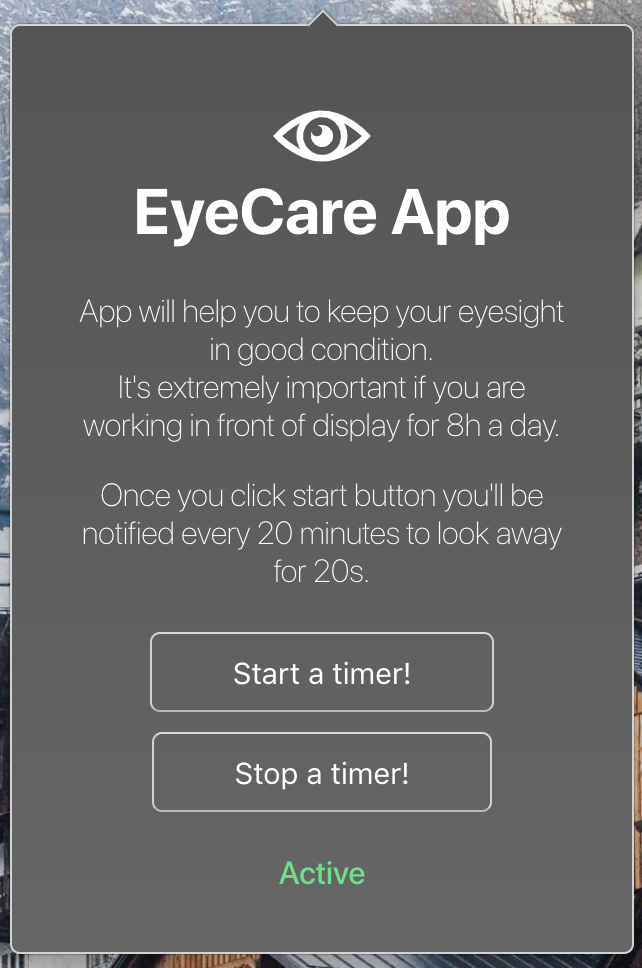

 

# EyeCare App

App will help you to keep your eyesight in good condition.\
It's extremely important if you are working in front of display for 8h
a day.

## What is does?

App will display native notification every 20 minutes to remind you to look away for 20 seconds **for yours eyes to rest**.\
Then after that time it'll remind you with notification to get back to work. Simply as it sounds.

## How to use it?

Once built run the app and you'll notice small eye icon in your try. Click on it.\
Then you can start a timer by clicking _Start a timer_

App is build on the top of [electron-quick-start-typescript](https://github.com/electron/electron-quick-start-typescript)

## Build

Run `yarn dist` and you'll find ready to execute file in `dist` directory

## Develop

Run `yarn start` and electron will start this app.
